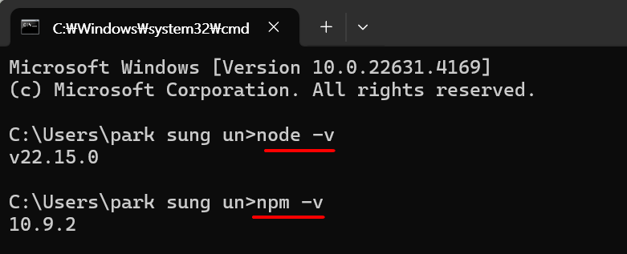

# 개발 환경설정

### 노드JS 다운 로드
[NODE.JS](https://nodejs.org/ko)  

```
node -v
npm -v
```

  
  
---

### vscode 설치

[VSCODE](https://code.visualstudio.com/)   
  
---

### vue Devtools 설치

[vue devtools](https://chromewebstore.google.com/detail/vuejs-devtools/nhdogjmejiglipccpnnnanhbledajbpd?utm_source=ext_app_menu)