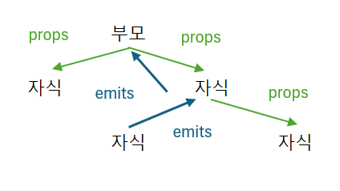

# vue.js 문법

### v-bind

```

// object.img 는 data함수에 있는 변수를 사용 할 수 있음
```

축약 가능 
```

// object.img 는 data함수에 있는 변수를 사용 할 수 있음
```

---

### v-bind:class 로 동적 class 추가 제거

```
<template>
    <h1 v-bind:class="{클래스명: 변수(true, false)}">안녕하세요</h1>

    <!-- boolean 타입 활용 -->
    <h1 v-bind:class="{red: true}">안녕하세요</h1>

    <!-- 변수 활용 -->
    <h1 v-bind:class="{red: isColor}">안녕하세요</h1>
</template>

<script>
    export default {
        name: 'test',
        data() {
            return {
                isColor: true
            }
        },
    }
</script>

<style>
    .red {
        color: red;
    }
</style>
```

---

### v-once 콘텐츠 잠구기

```
<template>
    <div>
        <h2 v-once>시작 숫자 : {{ count }}</h2>
        <h2>현재 숫자 {{ count }}</h2>
        <button v-on:click="increse">증가</button>
        <button v-on:click="decrese">감소</button>
    </div>
<template>
<script>
    export default {
        data() {
            return {
                count: 0,
            };
        },
        methods: {
            increse() {
               this.count++; 
            },
            decrese() {
                this.count--;
            }
        }
    }
</script>
```

---

### v-html
ex) 텍스트로 만들어진 html 요소를 vue 문법으로 삽입하는 방법  
  
js : document.element.innerHtml  
  
jQuery : $(element).html()  
  
```
<template>
    <h1 v-html="title"></h1>
</template

<script>
    export default {
        data() {
            return {
                title: '안녕하세요.<br /> 박성언 입니다',
            }
        }
    }
</script>
```

---

### v-for

```
<div v-for="(item, index) in array" :key="index">
    <p>{{ item.title }}</p>
<div>
```

반복문을 사용할때 key 프로퍼티 꼭 사용 필요  
반복대상 각각의 식별키로 이용됨

---

### v-if
ex) 모달 창을 예로 들자

```
<div class="modal" v-if="isModal"></div>
...
<script>
    export default {
        name: 'App',
        data() {
            return {
                isModal: false,
            }
        }
    }
</script>
```
isModal 변수가 false 일시 모달창이 보이지 않고  
true 라면 modal 창이 보인다.  
  
그 외에도 
```
v-if="score > 10 && score <= 50"
```
프로그래밍 코드 작성 가능

--- 

### ref

ref : 기본 자료형 및 obj 가능(ref는 Ref객체값 을 반환)  
  
```
const count = ref(0);
console.log(count.value);

const str = ref('hello');
console.log(str.value);

const obj = ref({name: 'park'});
console.log(obj.value.name);
```

---

### reactive

reactove : object만 사용 가능 합니다. (해당 object를 직접 반환)

```
const reactive_obj = reactive({
name: 'park',
});
console.log(reactive_obj);
console.log(reactive_obj.name);
```

---

### v-model

```
<input 
    type="search" 
    v-model="inputText"
    placeholder="검색어 입력" 
/>
```

v-model은 js의 'InputEvent'이벤트와 같은 역할을 합니다.  
  
inputText라는 변수의 값을 변경해줍니다.

```
<input 
    type="search" 
    @input="$event.target.value"
    placeholder="검색어 입력" 
/>

또는

<input 
    type="search" 
    @input="func"
    placeholder="검색어 입력" 
/>

...

<script>
    export default {
        name: 'test',
        data() {
            return {
                inputText: '',
            }
        },
        methos: {
            func(event) {
                this.inputText = event.target.value;
            }
        },
    }
</script>
```

---

### v-model 과 defineModel() => 양방향 바인딩

***defineModel() 을 안쓸경우***  

App.vue
```
<script setup>
  import Comp from './components/Comp.vue';
  import { ref } from 'vue';

  const title = ref('title');

  const onInput = (inputText) => {
    console.log(inputText);
    title.value = inputText;
  }
</script>

<template>
  <h1>{{ title }}</h1>
  <!-- <Comp :title="title" @onInput="onInput" /> -->
  <!-- <Comp :title="title" @onInput="(inputText) => title = inputText" />
</template>

<style scoped>

</style>

```

Comp.vue
```
<template>
    <h2>{{ title }}</h2>
    <p>inputText : {{ inputText }}</p>
    <input 
        type="text"
        @input="emits('onInput', inputText); inputText = $event.target.value" 
    />
</template>

<script setup>
    import { ref } from 'vue';

    const props = defineProps({
        title: String,
    });

    const inputText = ref('hello');

    const emits = defineEmits(['onInput']);
</script>

<style scoped>

</style>
```

***defineModel() 을 쓸경우***  

App.vue
```
<script setup>
  import Comp from './components/Comp.vue';
  import { ref } from 'vue';

  const title = ref('title');

  const onInput = (inputText) => {
    console.log(inputText);
    title.value = inputText;
  }
</script>

<template>
  <h1>{{ title }}</h1>
  <Comp v-model="title" />
</template>

<style scoped>

</style>

```

Comp.vue
```
<template>
    <h2>{{ model }}</h2>
    <p>inputText : {{ model }}</p>
    <input v-model="model"/>
</template>

<script setup>
    import { ref } from 'vue';

    const inputText = ref('hello');

    const model = defineModel();
</script>

<style scoped>

</style>
```

---

### props

부모가 자식한테 props 데이터를 보낼 수 있습니다.  
  
형재컴포넌트 끼리는 props 공유 불가능  
  
```
// 넘기는쪽
<template>
    <Text 
        :프롭스명="프롭스"
        :value="value"
        :func="func"
        :func="func('인자')"
        @func="func($event)"
    />
    <!-- $emit() 사용시 받는 인자는 $event로 받을 수 있다. -->
</template>
<script>
    import Text from './components/text.vue';
    export default {
        data() {
            return {
                value: ''
            }
        },
        methods: {
            func() {

            },
        },
        components: {
            Text, // 축약 가능
            // Text: Text,
        },
    }
</script>


// 받는쪽
<template>
    <p @click="$emit('func', '인자')">{{ text }}</p>

    <p @click="func('인자')">{{ text }}</p>
</template>
<script>
    export default {
        name: 'test',
        data() {
            return {

            }
        },
        props: {
            프롭스명: 타입,
            value: String,
            func: Function,
        }
    }
</script>
```
---

### $emit()

  
  
자식에서 부모로 상태값을 전송할때 사용

```
// 부모컴포넌트
<template>
    <InputComponent 
        @eventName="eventFunc($event)"
    />
</template>
<script>
    export default {
        name: 'test',
        data() {
            return {
                
            }
        },
        method: {
            eventFunc(parameter) {
                console.log(eventFunc);
            },
        }
    }
</script>

// 자식컴포넌트
<template>
    <input type="seach" @change="$emit('eventName', parameter); $event.target.value = parameter" />
</template>
<script>
    export default {
        name: 'test',
        data() {
            return {
                parameter: ''
            }
        },
        props: {
            // #emit()사용시 props로 등록을 안해줘도 됨
        }
    }
</script>
```
---

### watch

change Event 와 동일한 역할을합니다.  
watch는 변경을 감지할 변수명으로 함수를 만듭니다.  
watch는 2가지 파라미터를 받는데, 첫 번째 현재 값, 두 번째 이전 값을 받아 옵니다.

```
<template>
    <input type="text" @chnage="handleChange(event)" />
</template>

<script>
    export default {
        name: 'test',
        data() {
            return {
                inputValue = '',
            }
        },
        methods: {
            handleChange(event) {
                inputValue = event.target.value;
            }
        },
        watch: {
            inputValue(currentValue, beforeValue) {
                console.log(currentValue);
                console.log(beforeValue);
            }
        }
    }
</script>
```

---

### 뷰 이벤트 (v-on:)

#### event 객체 받기
```
<template>
    <input type="text" @input="handleChange($event, 'park')" />
</template>

<script>
    export default {
        data() {
            return {

            };
        },
        methods: {
            handleChange(event, str) {
                console.log(event);
                console.log(str);
            }
        }
    }
</script>
```

#### click
```
<button v-on:click="handleClick">클릭</button>
<button @click="handleClick">클릭</button>
<button @click="handleClick(파라미터를 넘길수도 있음)">클릭</button>
```
#### input
```
<input 
    type="search" 
    @input="func(event)"
    placeholder="검색어 입력" 
/>
// event로 event를 파라미터로 보낼 수 있습니다.
```

#### change
```
<input 
    type="search" 
    @change="func(event)"
    placeholder="검색어 입력" 
/>
// event로 event를 파라미터로 보낼 수 있습니다.
```

#### submit
```
<form @submit.prevent></form>
// evnet.preventDefault() 와 같음
```

---

### Life Cycle

1. create - 컴포넌트 인스턴스가 생성된 직후 DOM이 아직 생성되지 않은 시점  

2. mounted - 컴포넌트에서 DOM이 만들어진 시점(주로 외부데이터나 라이브러리를 추가하는 시점)  

3. updated - 데이터가 변경되면 DOM을 업데이트(데이터가 변경되는 시점)  

4. unmounted - 컴포넌트가 종료될때  

```
<script>
    export default {
        name: 'test',
        data() {
            return {
                interval: null,
            }
        },
        create() {
            console.log('create');
        },
        mounted() {
            console.log('mounted');

            this.interval = setInterval(() => {
                console.log('mounted');
            }, 3000);
        },
        updated() {
            console.log('updated');
        },
        unmounted() {
            console.log('unmounted');

            clearInterval(this.interval);
        },
    }
</script>
```

---
