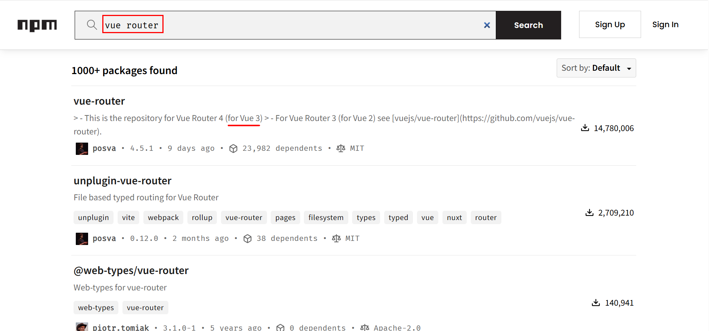
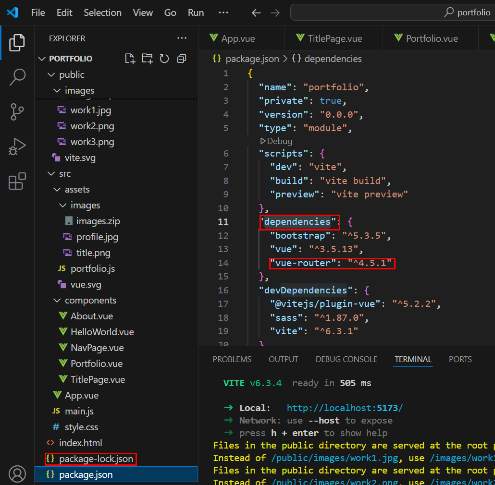

# vue router 설치

[npm](https://www.npmjs.com/)  
  
  
  
검색 후 버전에 따른 결과를 클릭합니다.  
  
  

명령어를 입력하여 설치 합니다.  

  
  
 

package.json의 dependencies에 추가 되었습니다.  

---

### router.js

path: src -> router -> router.js
```
import { createWebHistory, createRouter } from "vue-router";
import TitlePage from "../components/TitlePage.vue";
import Portfolio from "../components/Portfolio.vue";
import About from "../components/About.vue";

// 라우터 인스턴스 생성 인자 -> {옵션}
const router = createRouter({
    history: createWebHistory(),
    routes: [
        { path: '/', component: TitlePage},
        { path: '/protfolio', component: Portfolio},
        { path: '/about', component: About},
    ]
});

export default router;
```

---

 ### main.js

 ```
import { createApp } from 'vue'
import './style.css'
import App from './App.vue'

// 부트스트랩 import
import 'bootstrap/dist/css/bootstrap.min.css';
import 'bootstrap/dist/js/bootstrap.bundle.min';

// router import 추가
import router from './router/router.js';

// createApp(App).mount('#app')
createApp(App).use(router).mount('#app'); // 라우터 사용으로 use 함수 사용

 ```

 ---

 ### App.vue

 ```
<script setup>
  import NavPage from './components/NavPage.vue';
  import TitlePage from './components/TitlePage.vue';
  import Portfolio from './components/Portfolio.vue';
  import About from './components/About.vue';
</script>

<template>
  <NavPage />
  <!-- <TitlePage /> -->
  <!-- <Portfolio /> -->
  <!-- <About /> -->
  <router-view /> <!-- 라우터 사용 컴포넌트 -->
</template>

<style scoped lang="scss">

</style>
 ```

 ---

 ### NavPage.vue

path: src -> components -> NavPage.vue  
  
router-link 컴포넌트 이용 a태그 -> router-link 변경  
  
href -> to로 변경

 ```
<template>
  <nav class="navbar navbar-expand-lg bg-body-tertiary fixed-top" data-bs-theme="dark">
    <div class="container-fluid">
      <a class="navbar-brand" href="#">Navbar</a>
      <button class="navbar-toggler" type="button" data-bs-toggle="collapse" data-bs-target="#navbarNav" aria-controls="navbarNav" aria-expanded="false" aria-label="Toggle navigation">
        <span class="navbar-toggler-icon"></span>
      </button>
      <div class="collapse navbar-collapse" id="navbarNav">
        <ul class="navbar-nav" v-for="(item, index) in menuLists">
          <li class="nav-item" :key="index">
            <!-- <a class="nav-link active" aria-current="page" :href="`#${item.url}`">{{ item.title }}</a> -->
            <router-link class="nav-link active" aria-current="page" :to="`#${item.url}`">{{ item.title }}</router-link>
          </li>
        </ul>
      </div>
    </div>
  </nav>
</template>

<script setup>
  const menuLists = [
    {title: 'Home', url: '/'},
    {title: 'Portfolio', url: '/portfolio'},
    {title: 'Abou', url: '/about'},
  ];
  console.log(menuLists);
</script>

<style scoped lang="scss">

</style>
 ```

 ---

 ### url-parameter

router.js
```
import { createWebHistory, createRouter } from 'vue-router';
import Detail from "../components/Detail.vue";

const router = createRouter({
  history: createWebHistory(),
  routes: [
    {path: '/detail/:id', component: Detail}
  ],
  // /detail/:id  id란 이름으로 변수가 넘어갑니다.
});
```

Detail.vue
```
<template>
  {{ $route.params.id }}
</template>
```

---

### url-변경 방법

```
<router-link to="주소">이동</router-link>
```

```
<button @click="$router.push('주소')">이동</button>
```

```
<button @click="$router.back()">뒤로이동</button>
```

---