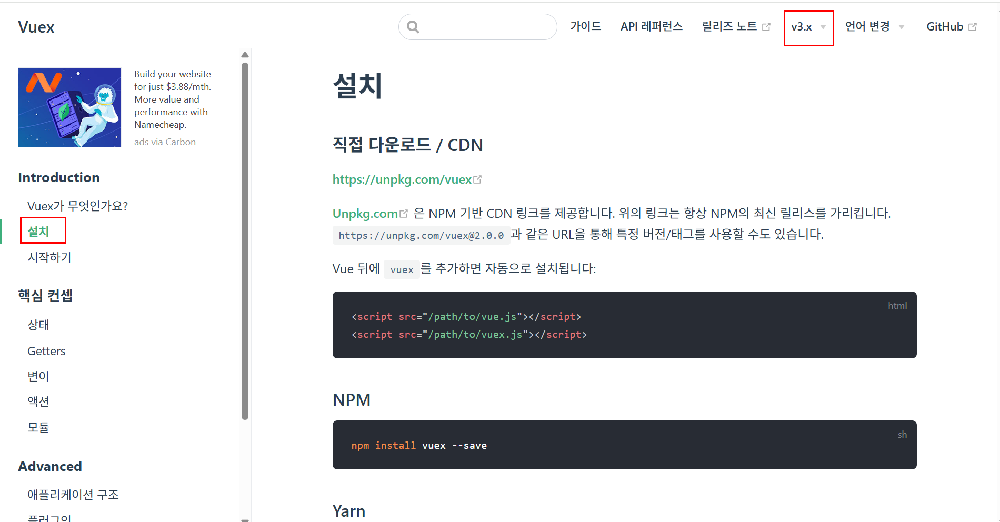
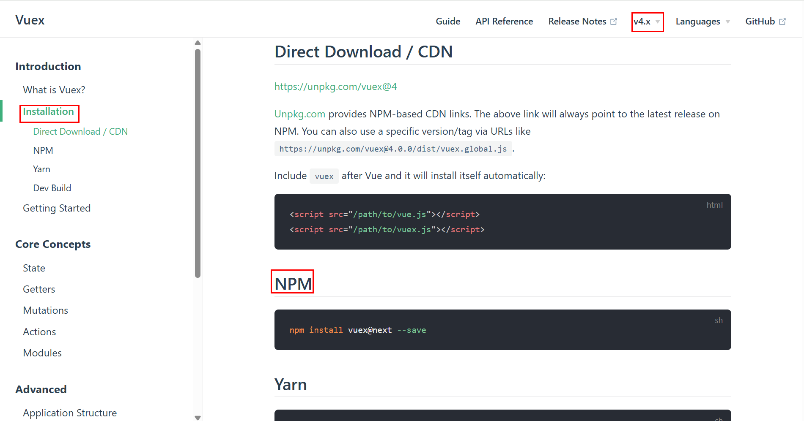

# vuex

[vuex](https://v3.vuex.vuejs.org/kr/)  
  
## 설치
  
[vuex 설치](https://v3.vuex.vuejs.org/kr/installation.html)  
  
  
  
  
버전선택
  
  
  
package.json 의 dependencies에 vuex 추가 확인

---

## vuex Stoer 만들기

### store.js

path: src -> store -> store.js

```
import { createStore } from 'vuex';

// store 만들기
export default createStore({
    state: {
        // state 저장
        count: 0,
    },
    getters: {
        //
    },
    mutations: {
        // mutations(데이터 변경)
        addCount(state, payload) {
            // 위에있는 state 를 가져옴
            console.log(state);
            console.log(payload);
            state.count += 1;
        },
        updateWeather(state, payload) {
            state.weatherData.icon = payload.weather[0].icon;
            state.weatherData.temp = payload.main.temp;
            state.weatherData.text = payload.weather[0].description;
            state.weatherData.location = payload.sys.country;
            state.weatherData.location = payload.name;
        },
        onSearchCity(state, payload) {
            state.weatherData.city = payload;
        }
    },
    actions: {
        // 비동기 작업시 actions를 거쳐서 mutations 에서 state 를 업데이트 합니다.

        // 날씨 데이터 가져오기
        getWeather(context) {
            const API_URL = `https://api.openweathermap.org/data/2.5/weather?q=${context.state.weatherData.city}&appid=491cf8ec2632ff6e56ac4df80d2ef8fc`;
            fetch(API_URL)
              .then((response) => response.json()) //
              .then((json) => {
                console.log(json);
        
                // mutations 함수로 날씨 정보 업데이트
                context.commit('updateWeather', json);
              }) // 
              .catch((error) => {
                console.error(error.message);
                alert(error.message);
              });
        } // end getWeather()
    }
});
```

### main.js

```
import { createApp } from 'vue'
import './style.css'
import App from './App.vue'
// import vuex stoer
import store from './store/store.js';

createApp(App)
    .use(store) // store 을 사용하겠다고 등록하는 과정
    .mount('#app');
```

---

## vuex Stoer 변수가져오기(template)

App.vue
```
<template>
    <p>{{ $store.state.count }}</p>
</template>
```

---

## vuex Stoer 변수가져오기(script)

App.vue
```
<template>
    <p>{{ count }}</p>
</template>
<sript stup>
    import { useStore } from 'vuex';

    const store = useStore();

    const count = store.state.count;
</script>
```

---

## vuex Stoer state 변수 변경하기(tamplate)

App.vue
```
<template>
    <p>{{ $store.state.count }}</p>
    <button @click="$store.commit('addCount', '변수를 보낼수 있음')">count++</button>
</template>
```

---

## vuex Stoer state 변수 변경하기(script)

App.vue
```
<template>
    <p>{{ $store.state.count }}</p>
    <button @click="handleClick">count++</button>
</template>
<script setup>
    import { useStore } from 'vuex';

    const store = useStore();

    const hanldeClick = () => {
        store.commit('addCount');
    }
</script>
```

--- 

## vuex state 변경 및 fetch 실행(template)

SearchBar.vue
```
<template>
    <form @submit.prevent>
        <div class="form-group">
            <input 
                @input="inputText = $event.target.value"
                type="saech"
                placeholder="지역을 입력해 주세요"
            />
            <button 
                @click="
                $store.commit('onSearchCity', inputText);
                $store.dispatch('getWeather')
            ">
                click
            </button>
        </div>
    </form>
</template>
<script setup>
  import { ref } from 'vue';

  const inputText = ref('');
</script>
```

---

## vuex state 변경 및 fetch 실행(script)

SearchBar.vue
```
<template>
    <form @submit.prevent>
        <div class="form-group">
            <input 
                @input="inputText = $event.target.value"
                type="saech"
                placeholder="지역을 입력해 주세요"
            />
            <button @click="handleClick">
                click
            </button>
        </div>
    </form>
</template>
<script setup>
  import { ref } from 'vue';

  const inputText = ref('');

  import { useStore } from 'vuex';

  const store = useStore(); 

  const handleClick = () => {
    store.commit('onSearchCity', inputText);
    store.dispatch('getWeather');
  }
</script>
```