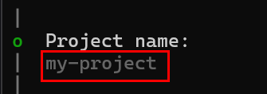

# composition api 소개 및 vite 설치

### vite 설치

```
npm create vite@latest
```

  
y를 입력해 설치를 진행해 줍니다  
  
  
프로젝트 명을 설정합니다  
  
  
프레임워크를 선택합니다.  
  
  
스크립트를 선택합니다.  

---

### 패키지 install

```
npm install
```

---

### 실행

#### 개발서버 실행
```
npm run dev
```
